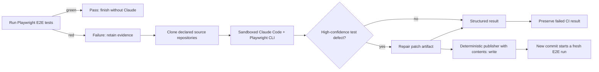

# Self-Healing Tests Demo

This repository is a small, deliberately constrained demonstration of AI-assisted E2E failure triage and repair.

The workflow establishes a trustworthy baseline and a narrow repair gate:

1. The repository contains the Playwright suite from `playwright-multiagent-demo/wynik`.
2. CI runs a deterministic public-auth smoke profile derived from that suite against the Awesome Testing training application.
3. Playwright preserves logs, screenshots, videos, traces, and a JSON report.
4. Claude Code runs only when the E2E test step fails.
5. Product and reference-test repositories are cloned only on that failure path.
6. Claude investigates the failure with repository context and Playwright CLI, then returns structured triage.
7. Only a test defect in this repository with at least 0.90 confidence may receive a minimal repair; every other classification remains read-only.
8. Claude has unrestricted tools only inside an ephemeral runner with a read-only GitHub token.
9. A separate deterministic publisher independently validates Claude's patch, commits it to the existing PR branch, and triggers a fresh run; the original failed run stays red.

## Current target

The default target is:

```text
https://aitesters.byst.re
```

Override it locally or in GitHub Actions with `APP_BASE_URL`.

The application is a public training playground. Tests must use fake data and must not assume persistent state.

## Run locally

```bash
npm ci
npx playwright install chromium
cp .env.example .env
# Replace the example administrator values in .env with the training credentials.
npm run test:e2e
```

The default command runs the credential-free smoke profile. The complete inherited suite is available with:

```bash
npm run test:all
```

The full suite creates users and products and requires administrator credentials. Against the shared public target it can also encounter environment rate limits, so it is intentionally not the first CI baseline.

Open the generated HTML report with:

```bash
npm run report
```

## Failure-only triage flow



The source registry is [`triage/source-repositories.json`](triage/source-repositories.json). The product description and diagnostic contract live in [`docs/product-overview.md`](docs/product-overview.md) and [`docs/triage-contract.md`](docs/triage-contract.md).

## GitHub configuration

The workflow expects one repository secret:

```text
ANTHROPIC_API_KEY
```

An optional repository variable overrides the target:

```text
APP_BASE_URL
```

`ADMIN_PASSWORD` and the non-sensitive administrator variables are needed only when the complete inherited suite is enabled in CI later.

For security, Claude triage is skipped for pull requests originating from forks because GitHub does not expose repository secrets to those runs.

## Repair boundary

Automated changes are limited to high-confidence `TEST_DEFECT` results in this repository. Repairs must preserve the original business assertion and prove the change with a focused rerun plus the smoke suite.

Claude runs with automatic approval and unrestricted local tools, but its job has only `contents: read`. A separate job receives the patch artifact and checks the classification, confidence, affected repository, reported file list, allowed paths, TypeScript, and smoke suite before it can push. On a PR failure it pushes only to that same-repository PR branch; on a trusted `main` failure it opens a new draft repair PR. No code path invokes merge.

GitHub does not offer a create-PR-but-never-merge permission: both operations use `pull-requests: write`. The write token is therefore exposed only to the deterministic delivery module, never to Claude or candidate test commands. Protect `main` with repository rules that require pull requests and human review.

Prompt construction, the structured-output schema, repair policy, artifact bundling, and publishing logic live in the dependency-free [`automation`](automation/) Python project. Run its tests with:

```bash
PYTHONPATH=automation python3 -m unittest discover -s automation/tests -v
```

The proposed permission boundary, validation gates, cross-repository token model, and effort estimates are in [`docs/repair-pull-requests.md`](docs/repair-pull-requests.md).
