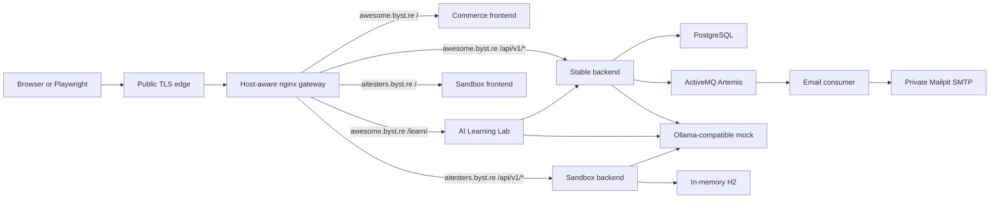

# Product overview

## What is deployed

Awesome Testing is a public training system for realistic browser, API, messaging, and AI-testing exercises. It has two public environments that share the same product family but have different operating guarantees:

| Environment | Purpose | Persistence and risk |
| --- | --- | --- |
| [awesome.byst.re](https://awesome.byst.re) | Stable, production-like commerce playground plus the AI Learning Lab under [`/learn/`](https://awesome.byst.re/learn/) | PostgreSQL-backed and intended to behave like a long-lived deployment. Tests must still use fake data and avoid destructive assumptions. |
| [aitesters.byst.re](https://aitesters.byst.re) | Disposable UI/API sandbox used by this demo | H2-backed, seeded with demo users, and reset regularly. Tests must never depend on state surviving between runs. |

The demo targets `https://aitesters.byst.re` by default. `APP_BASE_URL` can point the same tests at the stable environment when that is explicitly useful.

## Request and service topology

Both hostnames enter through the public TLS edge and then an internal nginx gateway. The gateway selects a deployment by the `Host` header and routes paths to services on a private Docker network. Databases, the message broker, SMTP capture, and model mock are not public endpoints.

For each hostname, `/api/v1/`, `/swagger-ui/`, `/v3/api-docs`, `/actuator/`, and websocket traffic are routed to that environment's backend. `/images/` is served by the gateway. The stable hostname additionally maps `/learn/` to the separately deployed learning application. Mailpit is intentionally private and `/mailpit` is not exposed by the public gateway.

## How the principal flows work

### Authentication and commerce

The React frontend calls the backend through same-origin `/api/v1/*` URLs. The backend owns JWT and refresh-token behavior, authorization and roles, user profiles, products, carts, orders, validation, and persistence. The stable deployment stores state in PostgreSQL; the disposable sandbox uses its own H2-backed application instance.

The public login and registration behavior currently expected by the smoke suite is:

- `/login` renders username and password inputs, sign-in, password recovery, and registration navigation.
- Empty required values produce client-side validation and do not authenticate.
- Invalid credentials keep the browser on `/login` and produce an error notification.
- Registration navigation opens `/register`.
- Submitting an empty registration form reports required fields without creating a user.

### Email

Backend operations publish email work to ActiveMQ Artemis. `jms-email-consumer` consumes the `email` destination and sends messages to the private Mailpit SMTP service. A browser symptom can therefore originate in the frontend, backend event publication, broker configuration, consumer, or SMTP capture; the trace and service logs are needed to assign ownership.

### AI Learning Lab and model calls

The AI Learning Lab is a separately built frontend mounted only at `awesome.byst.re/learn/`. It reuses the commerce session by validating it through `/api/v1/users/me`. Guided labs can call backend AI features, which use an Ollama-compatible API. The server deployment points those calls at `ollama-mock`, a deterministic implementation used to avoid the latency and variability of a real model during exercises.

## Repository map

These are all runtime and orchestration repositories declared by `awesome-localstack`, plus the test-design reference used by this demo:

| Repository | Responsibility | Typical failure ownership |
| --- | --- | --- |
| [`slawekradzyminski/awesome-localstack`](https://github.com/slawekradzyminski/awesome-localstack) | Docker Compose profiles, release image pins, internal/public nginx routing, deployment docs, and server automation. | DNS/TLS handoff, gateway routes, container health, private networking, incompatible image combinations, and deployment configuration. |
| [`slawekradzyminski/vite-react-frontend`](https://github.com/slawekradzyminski/vite-react-frontend) | React commerce UI for authentication, products, cart, checkout, profiles, and administration. Uses same-origin APIs and gateway-hosted product images. | DOM or accessible-name changes, browser routing, client validation, state handling, and UI/API integration. |
| [`slawekradzyminski/test-secure-backend`](https://github.com/slawekradzyminski/test-secure-backend) | Spring Boot API for identity, roles, commerce, QR, email events, traffic websocket, and Ollama-backed features. | HTTP contracts, authentication, authorization, persistence, server validation, event publication, and AI proxy behavior. |
| [`slawekradzyminski/ai-learning-lab`](https://github.com/slawekradzyminski/ai-learning-lab) | Interactive courses and browser labs for language-model and agent concepts, deployed under `/learn/`. | Learning UI behavior, lab instructions, session integration, and lab-to-backend requests. |
| [`slawekradzyminski/jms-email-consumer`](https://github.com/slawekradzyminski/jms-email-consumer) | Java consumer for the Artemis `email` destination; renders and sends mail to SMTP and exposes metrics internally. | Message consumption, payload handling, templates, SMTP delivery, and consumer health. |
| [`slawekradzyminski/ollama-mock`](https://github.com/slawekradzyminski/ollama-mock) | Deterministic Ollama-compatible `/api/generate` and `/api/chat` implementation, including streaming and tool definitions. | Mock model response contracts, NDJSON streaming, deterministic prompts, and tool-call fixtures. |
| [`AI-Testers-pl/playwright-multiagent-demo`](https://github.com/AI-Testers-pl/playwright-multiagent-demo) | Reference Playwright architecture from which this demo's `wynik` test tree was copied. It is not a deployed product component. | Reference fixtures, page-object patterns, and test-design provenance. |
| [`slawekradzyminski/self-healing-tests-demo`](https://github.com/slawekradzyminski/self-healing-tests-demo) | This isolated E2E suite and its failure-only Claude Code triage workflow. | Playwright fixtures, page objects, assertions, test data, reporters, and triage automation. |

The machine-readable clone list is [`triage/source-repositories.json`](../triage/source-repositories.json). Claude receives shallow checkouts of those repositories only after an E2E failure.

## Diagnostic ownership rules

Repository ownership is a hypothesis, not a classification. A stale locator in this repository is a `TEST_DEFECT` even when the changed element is implemented in the frontend. Conversely, a test that still expresses the documented behavior can expose a `PRODUCT_BUG` in the frontend or backend. Gateway or target availability can be a `CI_ENVIRONMENT` failure, while contradictory or insufficient evidence must remain `INCONCLUSIVE`.

The triage agent must correlate the failed assertion with Playwright artifacts, a focused rerun, live browser inspection, and the relevant source checkout before recommending a repository or change.
