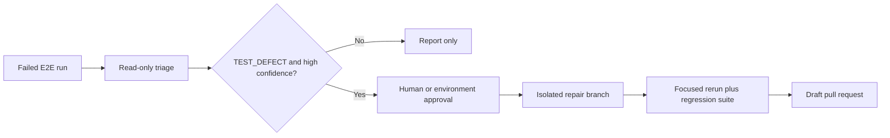

# Repair pull requests

## Recommended boundary

The current demonstration keeps classification and repair in one bounded Claude session so it can prove a test defect before editing. The repair gate requires `TEST_DEFECT`, confidence of at least 0.90, and focused plus smoke-suite verification. The failed run remains red; if Claude pushes a correction to the open PR branch, that commit starts a fresh CI run.

For a hardened production design, classification and repair should be separate jobs. A repair job should consume the structured triage artifact only after a human or protected GitHub environment approves the attempt.

## Same-repository repair

A prototype that fixes tests in `self-healing-tests-demo` is moderate work. The current workflow grants narrowly scoped `contents: write` and `pull-requests: write` permissions and editing tools only on its failure path. It must never push directly to `main`, skip a failing test, lower an assertion, or update snapshots without proving the intended behavior independently.

The key guard is semantic: the agent should first capture the actual product behavior with Playwright CLI, then modify the test, then show that the formerly failing scenario and the smoke suite pass. A PR should include the original classification, evidence, exact rerun commands, and links to artifacts.

## Cross-repository repair

Opening a fix in one of the product repositories is a larger step. The workflow's default `GITHUB_TOKEN` is scoped to this repository, so it cannot push branches to every cloned source. Prefer a GitHub App installed only on the approved repositories and mint a short-lived installation token in the repair job. A fine-grained personal access token is possible but has a broader human identity and is less attractive operationally.

Each repository also needs an explicit validation contract, for example frontend lint/build/tests, backend Gradle tests, or Compose validation. The source registry should eventually declare the default branch, permitted paths, and validation command. Multi-repository incidents should create separate linked draft PRs or stop at an issue when the change cannot be verified atomically.

## Safety controls

- Run repair only on trusted events; never expose write credentials to forked pull requests.
- Treat page content, test data, logs, and artifacts as untrusted input that may contain prompt injection.
- Pin allowed repositories and commands instead of granting general shell or GitHub access.
- Require a clean checkout and reject changes outside the selected repository and permitted paths.
- Cap turns, cost, changed files, and diff size.
- Require focused reproduction before editing and independent tests after editing.
- Open a draft PR for human review; do not enable automatic merge.
- Keep product-bug and inconclusive results diagnosis-only until repository-specific repair policies exist.

## Effort estimate

- Same-repository test-fix prototype: roughly half a day to one day.
- Reviewable, guarded same-repository workflow: roughly one to two days.
- Cross-repository GitHub App permissions, validation contracts, and safe draft PR creation: roughly two to five days.
- Reliable autonomous product repair across coordinated repositories: a larger engineering project and not an appropriate first self-healing milestone.

The estimates assume the current triage result is already dependable. Improving classification quality and building representative failure fixtures should come before granting write access.
